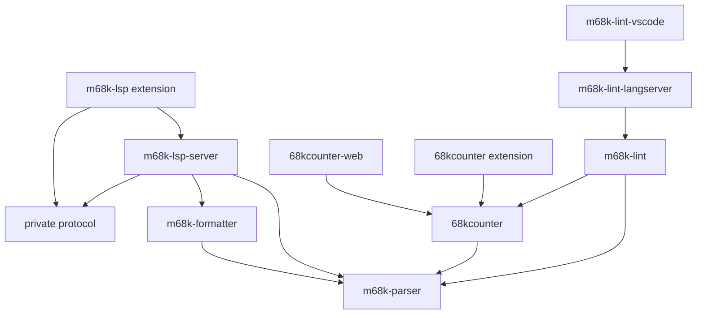

# m68k toolchain: audit and migration proposal

Audit date: 2026-09-12. Status: local migration authorised and in progress. Publishing and production deployment cutover remain separate steps.

## Scope and evidence

Inspected local manifests, TypeScript and lint configuration, build scripts, tracked CI workflows, public entry points, and representative tests across seven repositories. This is a static migration audit: the external repositories' builds and tests have not been rerun, npm/Marketplace release state has not been verified, and Vercel account settings have not been inspected. Version numbers below are manifest declarations, not a lockfile-resolved inventory or claims about the newest available releases.

| Repository        | Inspected HEAD | Branch | Local state                                                                                     |
| ----------------- | -------------- | ------ | ----------------------------------------------------------------------------------------------- |
| m68k-lsp          | 209d265        | master | Formatter extraction and integration are uncommitted; `.vscode/settings.json` is also untracked |
| m68k-parser       | e21f0cb        | main   | Modified package-lock.json                                                                      |
| m68k-lint         | e8c0c58        | main   | Clean                                                                                           |
| m68k-lint-lsp     | a770541        | main   | Clean; unreleased per owner                                                                     |
| 68kcounter        | 57179d2        | master | Clean                                                                                           |
| 68kcounter-vscode | 60cae26        | master | Clean                                                                                           |
| 68kcounter-web    | 544f59d        | master | Clean; includes the newly pulled Vite migration                                                 |

Do not discard either repository's local changes. Before importing, commit the intended formatter work and establish which parser lockfile changes belong in its source history. Import exact recorded commits rather than moving branch tips.

## Current packages and tooling

| Component            | Version | Build / module contract                                                                  | Tests                                                  | Tooling                                         |
| -------------------- | ------- | ---------------------------------------------------------------------------------------- | ------------------------------------------------------ | ----------------------------------------------- |
| m68k-parser          | 1.10.0  | esbuild, neutral platform, ESM `.mjs` and CJS `.cjs`, separate declarations; CLI wrapper | Jest 30 + ts-jest                                      | TS 5.9, ESLint 9, Prettier 3                    |
| m68k-formatter       | 0.1.0   | tsc CJS, declarations, library and CLI                                                   | Jest 30 + ts-jest; CLI subprocess tests                | TS 5.9, shared LSP lint configuration           |
| m68k-lsp-server      | 0.11.3  | esbuild CJS; CLI; bundled vasm assets                                                    | Jest 30 + ts-jest                                      | TS 5.9, ESLint 9, Prettier 3                    |
| m68k-lsp extension   | 0.11.3  | CJS extension plus bundled server/assets                                                 | Jest tests for client logic                            | VS Code `^1.85.0`                               |
| @m68k-lsp/protocol   | 0.0.0   | Private source package consumed during builds                                            | Covered by consumers                                   | Keep private                                    |
| 68kcounter           | 4.1.0   | tsc CJS, ES2020 target, declarations, CLI                                                | Jest 26 with Babel configuration                       | TS 4.2, ESLint 7, Prettier 2                    |
| m68k-lint            | 1.3.0   | tsc ESM/NodeNext; CLI; `./project-config` export; JSON schema                            | Jest 30 + ts-jest ESM using VM-modules flag            | TS 5.9, ESLint 10, type-aware rules, Prettier 3 |
| m68k-lint-langserver | 0.1.0   | esbuild CJS executable; linter bundled from devDependency                                | Node test runner against built stdio server            | TS 5.9, ESLint 10                               |
| m68k-lint-vscode     | 0.1.0   | Private npm package; VSIX bundles server                                                 | Server integration suite, no separate host suite found | VS Code `^1.85.0`                               |
| 68kcounter extension | 1.2.0   | tsc CJS; manifest name is also `68kcounter`                                              | Mocha inside VS Code via old `vscode-test` launcher    | TS 4.1, ESLint 7, Prettier 2; VS Code `^1.55.0` |
| 68kcounter-web       | 0.1.0   | Vite 8, React 19, ESM; Vercel deployment per owner                                       | Vitest 5, jsdom, Testing Library                       | TS 5.9, ESLint 9 flat config, Prettier 3        |

The web app is already modernised: do not plan a CRA migration. Its declared Node requirement is `^20.19.0 || >=22.13.0` and it now consumes counter `^4.1.0`.

### Dependency graph

Arrows mean “uses”; some edges are build-time bundling rather than published runtime dependencies.



Bundled server relationships are currently partly encoded in copy scripts rather than package manifests. Make these dependencies visible to task orchestration and release planning. Retain separate assembly and lint LSPs for the migration; combining their behavior is a separate product decision.

## Proposed repository and identity

Use the agreed repository name `m68k-tools` and default branch `main`. Keep published names and versions. Directories match package names except for the counter extension's required Marketplace compatibility treatment.

```text
packages/
  m68k-parser/
  m68k-formatter/
  68kcounter/
  m68k-lint/
  m68k-lsp-server/
  m68k-lint-langserver/
  protocol/
apps/
  m68k-lsp/
  m68k-lint-vscode/
  68kcounter-vscode/
  68kcounter-web/
```

### Counter extension name collision

The library and extension both use `name: 68kcounter`. Renaming the extension's shipping manifest would change its ID: VS Code defines identity as `publisher.name` ([manifest reference](https://code.visualstudio.com/api/references/extension-manifest)). Preserve `gigabates.68kcounter`, command IDs, and settings.

Proposed solution: use private workspace package `68kcounter-vscode`; generate a staging directory outside the workspace globs containing the built extension and a shipping manifest with `name: 68kcounter`, `publisher: gigabates`, and the workspace package's version. Package and run extension-host tests from that directory. Assert the identity inside every generated VSIX. Never rewrite the tracked manifest in place. This is a proposed mechanism that needs a packaging prototype, not an already verified solution.

Alternative: exclude the original extension directory from workspaces and orchestrate it separately. That avoids manifest generation but weakens the unified dependency and release workflow. Prefer staging if the prototype succeeds.

## Proposed shared baseline

| Area                   | Proposal                                                                              | Compatibility boundary                                                                                           |
| ---------------------- | ------------------------------------------------------------------------------------- | ---------------------------------------------------------------------------------------------------------------- |
| Package manager        | pnpm; pin one exact tested version in root `packageManager`; one lockfile             | Use `workspace:^` for libraries; pack with pnpm to translate workspace ranges                                    |
| Build/development Node | Node 22.23.2, pinned for development                                                  | Do not silently raise consumer engines or VS Code minimums                                                       |
| Runtime tests          | Build on Node 22; target Node 22 for published Node packages and test on 22 and 24    | Record the agreed Node 22 baseline in engines and release notes; verify exact minimum minor against dependencies |
| TypeScript             | Initially align on 5.9.3, already shared by the modern projects                       | Separate Node, browser, test, and extension configurations; do not globally enable DOM or Node globals           |
| Library builds         | Pilot tsdown on formatter, then parser/counter/lint                                   | Preserve existing entry points, module formats, declarations, executable shebangs and assets                     |
| Apps                   | Keep Vite for web; retain esbuild for extensions/LSP bundles initially                | Bundled application dependencies need different treatment from external library dependencies                     |
| Unit tests             | Target Vitest, migrate one package at a time                                          | Keep Node stdio integration tests and Mocha extension-host tests initially                                       |
| ESLint                 | Shared flat config; choose one version after React/import-plugin compatibility checks | Do not downgrade linter's type-aware checks just to share a base; ESLint 9 vs 10 remains a compatibility gate    |
| Formatting             | Prettier 3, one root configuration and independent format check                       | Preserve assembly fixture whitespace; keep mass reformatting separate                                            |
| Releases               | Changesets, independent versions and package-prefixed tags                            | Private apps/VSIX releases require explicit configuration and separate publishers                                |

Current tsdown requires `^22.18.0 || ^24.11.0 || >=26.0.0` for its build process ([getting started](https://tsdown.dev/guide/getting-started)). This does not itself require the emitted libraries to use that minimum. Node 24 is LTS and Node 20 is EOL ([Node release status](https://nodejs.org/en/about/previous-releases)). Recheck requirements when selecting exact tooling versions.

Pin package-specific Node type declarations to supported APIs: a global upgrade to the web app's `@types/node` 26 would let unsupported APIs slip into Node 22-compatible packages. TS compilation target alone does not provide runtime API compatibility.

Use shared strict TypeScript defaults with explicit environments. Enable additional strictness in separate changes, preserving existing linter checks. Centralise dev-tool versions without relying on undeclared dependencies. Keep root scripts predictable: `build`, `typecheck`, `lint`, `format:check`, `test`, `test:integration`, and `check`. CI tests must run once and exit; the web app's current `vitest` command may watch locally, so provide an explicit run mode.

## Compatibility findings and acceptance checks

1. **Counter extension is still on counter 3.x.** Its manifest requests `^3.1.2`, whereas the web app and linter use 4.x. Verify parsing, cycle totals, CPU selection and display behavior before switching it to the local workspace counter. The owner will implement this code upgrade after migration. Import it with its registry 3.x dependency intact, and exempt that dependency from automatic workspace rewriting until the upgrade is complete; do not hide the upgrade in the import commit.
2. **Counter browser interop is already special.** `68kcounter-web/vite.config.ts` forces `needsInterop` and `src/parse.ts` contains an interop comment. Preserve default and named exports through tsdown adoption. Test dev server and production browser output; remove workarounds only after proving they are unnecessary. Keep CLI-only dependencies out of browser entry points.
3. **Parser exports support both ESM and CJS.** Its build is platform-neutral. Test both consumers and browser use. The manifest declares a root `cli.js` but its `files` list does not explicitly include it: inspect the actual packed archive before deciding whether a fix is needed.
4. **Linter's package includes more than its main API.** Preserve `./project-config`, CLI, JSON schema and generated rule docs. Inspect existing consumer deep imports before adding new restrictive export maps to packages that currently lack them.
5. **Linter checks are substantive.** Preserve coverage floors (statements 84, branches 79, functions 89, lines 89), generated-doc verification and the rule-impact audit. Its separate semantic verification uses `@specy/s68k`/WASM; retain it as a separate check with its existing prerequisites. Coverage providers can calculate differently: investigate differences rather than lowering thresholds automatically.
6. **Integration suites test installed behavior.** Lint LSP tests spawn the built server over stdio. Counter extension tests download and launch VS Code. Keep these separate from fast unit suites; use a suitable display environment on Linux and test the declared minimum extension host before changing `engines.vscode`.
7. **Assembly extension bundles assets.** Preserve vasm WASM files, grammar, snippets, icon, and server paths. The existing build targets Node 20 but advertises VS Code 1.85; verify actual minimum-host compatibility instead of assuming those requirements agree.
8. **Existing npm layouts differ.** LSP build scripts copy sibling outputs and use a source alias for the formatter. Tests also map its package name directly to source. Migrate build ordering and add packed-artifact tests so workspace aliases cannot conceal missing package files.
9. **Whitespace is semantic in fixtures.** Retain the linter's assembly-specific EditorConfig exception and exclude generated assembly fixtures from broad formatting operations.
10. **Generated paths and links will move.** Update schemas (including the lint extension's raw GitHub schema URL), repository directories, badges, examples, launch tasks, test fixtures and documentation links after import. Preserve all licenses and bundled third-party notices.

## CI, versioning and deployment

Only the assembly LSP and linter currently have tracked GitHub Actions workflows in the inspected checkouts. Assembly CI builds/checks on Node 20/22/24; linter CI runs on 20/22 with coverage, generated docs and impact checks. Absence of tracked workflows does not prove absence of external automation. Inventory actual registry trusted-publisher settings, Marketplace credentials, repository settings and Vercel configuration before cutover, without copying secrets into the repository.

Use one required CI workflow initially; optimise affected-package selection later. Required checks:

- Frozen pnpm install, typechecking including tests, lint, formatting, and non-watch unit suites.
- Build libraries in dependency order and package every publishable artifact.
- Install tarballs in isolated temporary consumers with no workspace source aliases or ancestor node_modules fallback; smoke-test public imports, supported module formats and CLIs.
- Build all VSIX files; assert publisher/name/version and bundled assets. Run host smoke tests separately.
- Build the counter web app against workspace packages and exercise representative timing/CPU interactions in a browser.
- Retain generated docs, rule-impact audit and appropriate semantic checks.

Use a Changesets release PR with independent package versions. Configure `baseBranch` to the actual chosen default (current repos mix main/master). Preserve old changelogs and package versions. Changesets descriptions are pending user-facing notes, consumed into per-package changelogs on versioning.

Root/protocol/apps should be explicitly classified as npm-publishable or private. The existing assembly extension and web manifests are not marked private; do not let a generic publisher infer intent from that alone. Treat the lint server as unreleased even though it lacks `private: true`. Keep its initial publication disabled until deliberately enabled.

For private VSIX packages, configure version/tag behavior explicitly and publish to Marketplace through a dedicated workflow. The counter workspace tag would be `68kcounter-vscode@1.2.x`, distinct from the npm library's `68kcounter@4.x`, even though the shipping extension manifest retains `68kcounter`.

Track bundling changes: a parser fix may require rebuilding and releasing downstream servers/extensions even without source edits there. Encode dependency edges and add the required app/server changesets explicitly until propagation is proven. Web production deployment can remain commit-based and need not wait for an npm release; it will then include workspace code that may not yet be published. Automatic web deployments from `main`, including workspace library changes, are agreed.

### Vercel

Multiple Vercel projects can share a Git repository, each with its own Root Directory ([monorepo documentation](https://vercel.com/docs/monorepos)). Proposed web root: `apps/68kcounter-web`. Preserve the existing project/domain, review environment variables and production branch, and allow access to workspace packages outside the root directory. Validate the dependency build/install command and preview deployment before changing production linkage. Configure affected-project detection to include counter/parser changes; root lockfile changes may legitimately trigger builds.

No Vercel settings or production deployments were changed by this audit. The old repository remains the deployment source until a deliberate cutover. If the preview fails, retain that connection; if cutover fails, reconnect the recorded previous repository/settings and restore the previous successful deployment as appropriate.

## Ordered migration

Each step should leave a buildable, reviewable state. Exact commit boundaries can be adjusted, but avoid combining imports with behavior changes.

1. **Approve identity and baseline.** Confirm repository name/default branch, counter-extension staging approach, proposed toolchain, runtime policy and which components may publish. Record decisions here.
2. **Capture baselines.** Resolve local work intentionally; record source SHAs, test results, tarball/VSIX contents, web production output and current deployment settings. This audit is not that execution baseline.
3. **Finish the formatter extraction.** Review and commit current work independently; retain its tests. Do not mix the user's `.vscode/settings.json` into the migration.
4. **Prepare this repository.** Rename existing directories, update path-dependent scripts, then migrate npm to pnpm in a separate change. Preserve build behavior. Prototype counter-extension staging before importing its conflicting manifest into the workspace.
5. **Import histories without squashing.** Import parser, counter, linter, lint-LSP repository, counter extension and web app at recorded commits. Use a non-squashed subtree import; flatten the lint-LSP's client/server into final directories in a subsequent move commit. Preserve licenses and changelogs. Retain historical tags/releases in old repos; optionally import namespaced tags. Do not archive sources yet.
6. **Connect dependencies incrementally.** Validate each consumer against local packages. Handle counter extension 3-to-4 separately. Record bundled edges and retain published API contracts. Get full baseline CI green before broad tooling changes.
7. **Modernise builds and tests separately.** Pilot tsdown on formatter; then parser, counter and lint. Migrate Jest unit suites to Vitest one package at a time, retaining behavioral assertions and integration harnesses. Consolidate ESLint/Prettier after plugin compatibility verification. Keep Vite and initial esbuild app builds.
8. **Add release automation.** Configure Changesets, perform a local versioning rehearsal on a disposable branch, inspect versions/dependencies/changelogs/private-package behavior, and test tarballs/VSIX staging without publishing. Then enable the release PR workflow and separately authorised publishers.
9. **Cut over hosting and repositories.** Verify Vercel preview, switch production linkage deliberately, update metadata and notices, move relevant issues where practical, disable old publish automation, and archive old repositories after the new path is proven.

Rollback is per migration commit until external cutover. Preserve original refs and tags. After publishing, never try to reuse an npm version or rewrite a release tag; issue a corrective release. Avoid simultaneous active publishing from old and new repositories.

## Agreed decisions and remaining details

Owner decisions recorded after review:

- Repository name: `m68k-tools`; default branch: `main`.
- Tooling direction approved: pnpm, tsdown for libraries/CLIs, Vitest for unit tests, Changesets, shared lint/format configuration; preserve integration-runner exceptions.
- Development/build runtime: Node 22.23.2. Published Node packages should target Node 22; exact minimum minor remains a dependency compatibility check. Document dropped Node 20 support when releasing.
- Raising the minimum VS Code version is acceptable. Proposed starting point: `^1.101.0`, subject to dependency and extension-host tests; this release shipped Node 22.15.1 with Electron 35. Set VS Code type declarations to the chosen API floor rather than latest.
- Both LSPs and their corresponding extensions remain separate products.
- Automatic web deployments from `main` are agreed.
- Counter extension's 3.x-to-4.x application code upgrade belongs to the owner after migration. Keep the registry 3.x dependency until then; importing the project must not force this upgrade.

### VS Code and Node runtime

Raising `engines.vscode` restricts which VS Code versions can install the extension. Changing `@types/vscode` only changes compile-time API declarations. Neither setting installs Node on the user's machine. Desktop VS Code supplies its extension-host runtime through Electron; remote extension hosts use VS Code Server's Node runtime. VS Code 1.101 explicitly upgraded the Node extension host from 20 to 22 (22.15.1). See [release notes](https://code.visualstudio.com/updates/v1_101) and [extension hosts](https://code.visualstudio.com/api/advanced-topics/extension-host).

Check how each LSP process launches: a fork using the extension runtime and an executable launched with a user's PATH Node have different runtime guarantees. Test the chosen minimum VS Code release and current stable, plus standalone servers on supported Node versions. If dependencies require a Node 22 minor newer than the selected VS Code host supplies, choose a later VS Code minimum or compatible dependencies.

### VSIX staging explanation (agreed)

A VSIX is the installable extension archive. Staging means preparing its contents in a generated build directory before invoking `vsce`:

```text
Tracked workspace manifest              Generated shipping manifest
name: 68kcounter-vscode                 name: 68kcounter
private: true                          publisher: gigabates
version: 1.2.0                         version: 1.2.0
          build/copy → archive as VSIX → existing extension identity
```

The different workspace name resolves the collision with the npm library. The generated shipping name preserves the existing Marketplace ID. The version and all other extension metadata come from the tracked source; we do not maintain two hand-edited manifests. Development launch configuration and host tests would point at the generated extension directory too. The owner has accepted this mechanism; validate its prototype before relying on it.

The audit above records the pre-migration state. Local implementation has now progressed as recorded below; external repository and deployment changes remain outstanding.

## Implementation notes

TypeScript 5.9 is a transitional baseline. Evaluate TypeScript 7 separately after the tsdown/Vitest migrations, including compatibility with type-aware ESLint and declaration generation. VSIX staging is agreed. Node 22 is the development and published-runtime family; exact consumer minor floors still need compatibility verification.

### Baseline execution — 2026-09-12

- Assembly workspace: all checks passed, 435 tests; server and extension builds passed. Formatter extraction committed as `af7ebfb`; local branch renamed to `main`.
- Parser: build passed; 362 tests passed. Existing modified lockfile preserved.
- Linter: build, coverage suite and rule-impact audit passed. Audit reported 122 cases across 120 rules, zero regressions or missing cases.
- Counter, web and counter extension: baseline commands could not run because their local tool dependencies are not installed.
- Lint LSP: baseline build could not resolve esbuild because dependencies are not installed.
- Raw command output is retained locally in `/tmp/m68ktools-baselines`; these temporary logs are not part of the repository.

Missing-tool baselines are not passing baselines. Install dependencies and rerun before changing the affected applications' behavior. No external source files were modified by these baseline commands.

### Local migration execution — 2026-09-12

- Local branch is `main`; workspace name is `m68k-tools`. The GitHub repository and local directory still have their original names until cutover.
- Imported all six repositories with non-squashed subtree history. Flattened the lint LSP into separate server and extension workspaces. Original supporting files remain in `docs/imported-m68k-lint-lsp`.
- Connected parser, formatter, counter, linter and application dependencies through pnpm workspaces. Counter extension deliberately retains `npm:68kcounter@^3.1.2` until its application upgrade.
- Pinned pnpm 12.4.1, Node 22.23.2, TypeScript 5.9.3, ESLint 9.39.5 and Prettier 3.9.6. Migrated library builds to tsdown 0.23.0 and unit suites to Vitest 5. Preserved Vite, esbuild application builds, stdio integration tests and the VS Code host harness.
- Set published Node engine floors to 22.15.1 and VS Code engine/type floors to 1.101. Development tooling requires Node 22.18 or later. Tests below ran on Node 22.23.2; the minimum runtime and VS Code host still need execution checks before release.
- Full workspace checks passed: 435 assembly/formatter tests, 362 parser tests, 3,062 counter tests, 727 lint tests, two web tests and 13 lint-LSP integration tests. Linter coverage thresholds passed; rule-impact audit covered 122 cases across 120 rules with zero regressions or missing cases.
- All six npm tarballs passed isolated imports and CLI smoke checks. Corrected counter's package file list to include its complete distribution and parser's file list to include its CLI.
- Built and inspected all three VSIX archives. Counter retains `gigabates.68kcounter`; assembly and lint extensions retain their own identities. Counter debugging and host tests use the generated staging directory. Graphical host tests have not run in this environment.
- Changesets versioning rehearsal passed in a disposable directory: package versions and changelogs updated, pending changeset consumed, private extension versions bumped, and the counter extension's registry 3.x dependency preserved. No real versions were bumped or tags created. Release workflow is manual and creates version PRs only; publishers remain unwired.
- Web production build passes. Vercel configuration is prepared for project root `apps/68kcounter-web`; no Vercel project settings or deployment linkage have changed.
- Existing web React hook warning and counter expression-evaluation build warnings remain. Imported source formatting is deliberately excluded from the root formatting sweep to avoid an unrelated whole-source rewrite; package lint checks still run.

Next cutover steps: validate VS Code host/minimum runtime, review a Vercel preview, rename the remote repository and change its default branch, update repository metadata and source notices, and then enable separately reviewed publication/deployment settings. Keep the old repositories available until the new workflow is proven. The owner's counter extension API upgrade remains deferred.
